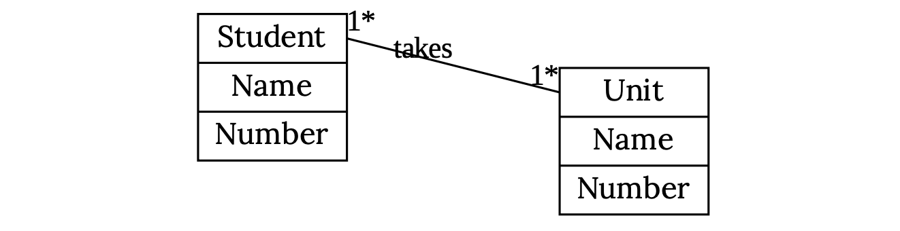
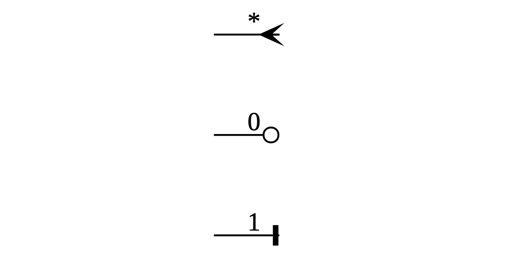
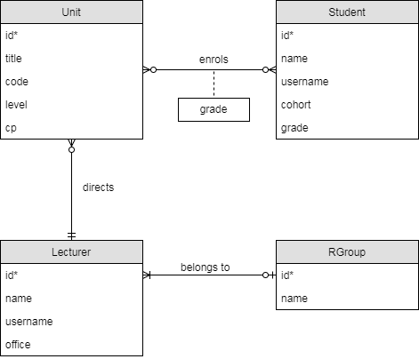
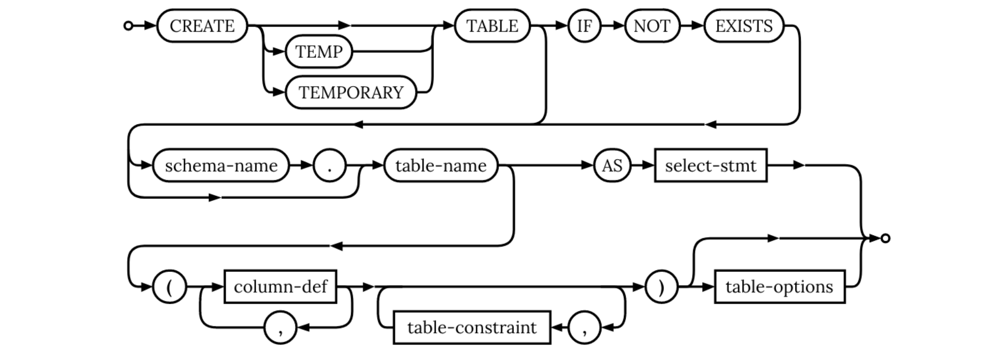
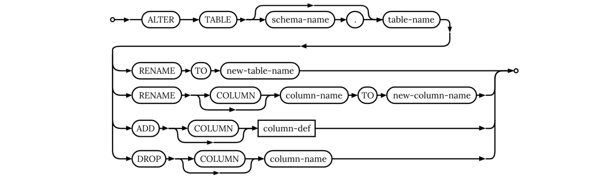
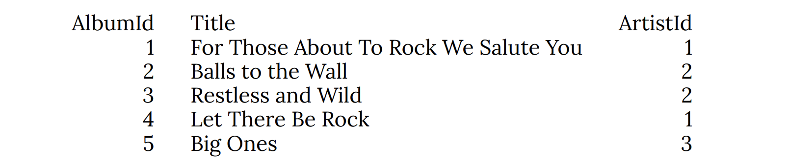
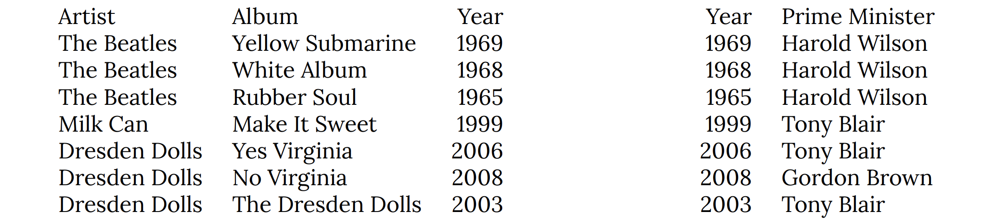

# SQL Databases

## Introduction

* highly optimized storage of tabular data
* each database will contain tables that store data
* data in tables can be queried using a language called SQL

Server-side databases: MariaDB, MySQL  
File-style databases: Sqlite  

Remeber to secure your database!

## Relational modelling

* Tables consist of entities
* Entities have attributes
* Entities attributes do not need to be unique in each table
* Entities can be linked to entities in other tables

### Multiplicity



'0', '1', or '*' (greater than 1) are used to denote how many of each entity are linked to another.

### Alternate Graphical Form



### Keys

* A key for an entity is the set of attributes needed to uniquely refer to it
* A **candidate key** is a minimal set of attributes needed to uniquely refer to it
* The **primary key** for an entity is the key we use
* If a key contains multiple attributes its called a **composite key**
* If a key is a meaningless ID column you added just for the sake of having a key its called a **surrogate key**
* An attribute that refers to another key is called a **foreign key**

### Example



Asterisks denote the primary key. 

## Creating a Database

SQL commands are written in capital letters by convention. 

### CREATE TABLE

Creates a table. 

``` sql
CREATE TABLE IF NOT EXISTS student (
	name TEXT NOT NULL,
	number TEXT NOT NULL,
	PRIMARY KEY (number));

CREATE TABLE IF NOT EXISTS unit (
	name TEXT NOT NULL,
	number TEXT NOT NULL,
	PRIMARY KEY (number));

CREATE TABLE IF NOT EXISTS class_register (
	student TEXT NOT NULL,
	unit TEXT NOT NULL,
	FOREIGN KEY (student) REFERENCES student(number),
	FOREIGN KEY (unit) REFERENCES unit(name),
	PRIMARY KEY (student, unit));
```

Here, class_register has foreign keys to student and unit. Note that you have to create a table before another table can have a foreign key to it. 



### DROP TABLE

Deletes a table. 

``` sql
DROP TABLE IF EXISTS class_register;
DROP TABLE IF EXISTS student;
DROP TABLE IF EXISTS unit;
```

Note that you have to delete all other tables with foreign keys to a table before you can delete it.

### Types

**INTEGER** whole numbers  
**REAL** lossy decimals  
**BLOB** binary data (images/audio/files…)  
**VARCHAR(10)** a string of 10 characters  
**TEXT** any old text  
**BOOLEAN** True or false  
**DATE** Today  
**DATETIME** Today at 2pm  

These are different depending on the database; sometimes certain types are simplified to TEXT. 

### Table Constraints

**NOT NULL** can’t be NULL  
**UNIQUE** can’t be the same as another row  
**CHECK** arbitrary checking (including it conforms to a regular expression)  
**PRIMARY KEY** unique, not NULL and (potentially) autogenerated  
**FOREIGN KEY** (IGNORED BY MARIADB) other key must exist  

These are not checked in SQLite unless you use STRICT. 

### ALTER TABLE



### INSERT INTO

``` sql
INSERT INTO unit(name, number)
VALUES ("Software Tools", "COMS100012");
```

## Querying a Database

### SELECT

``` sql
SELECT * FROM table;
```

Selects all attributes from table. 

``` sql
SELECT (table.)attribute, ... FROM table;
```

Only selects the given attributes: helpful if joining multiple tables.  

### LIMIT

``` sql
SELECT * FROM album
LIMIT 5;
```

Limits the number of entities displayed. 



### JOIN

``` sql
SELECT *
FROM album
JOIN artist
ON album.artistid = artist.artistid
LIMIT 5;
```

Joins artist to album. 


### AS

``` sql
SELECT album.title AS album,
artist.name AS artist
FROM album
JOIN artist
ON album.artistid = artist.artistid
LIMIT 5;
```

Names an attribute or table. Can be used as part of a SELECT or FROM. 


### WHERE...condition

``` sql
SELECT artist.name AS artist
FROM album
JOIN artist
ON album.artistid = artist.artistid
WHERE album.title LIKE '%Rock%'
LIMIT 5;
```

Filters rows for an expression. '%' means any number of characters. 


### HAVING...condition

``` sql
SELECT column_name(s)
FROM table_name
WHERE condition
GROUP BY column_name(s)
HAVING condition
ORDER BY column_name(s);
```

WHERE cannot be used with aggregate functions, so HAVING is used instead. 

### SELECT DISTINCT

``` sql
SELECT DISTINCT artist.name AS artist
FROM album
JOIN artist
ON album.artistid = artist.artistid
WHERE album.title LIKE '%Rock%'
LIMIT 5;
```

DISTICT causes only unique rows to be shown (i.e. duplicates are removed).

### GROUP BY, COUNT()

``` sql
SELECT artist.name AS artist,
COUNT(album.title) as albums
FROM album
JOIN artist
ON album.artistid = artist.artistid
WHERE album.title LIKE '%Rock%'
GROUP BY artist
LIMIT 5;
```

GROUP BY groups entities into rows. The attribute of the first entity will be displayed in the row. COUNT() creates a column counting the number of entites in that row. 

*COUNT ignores NULLs.*


### ORDER BY

``` sql
ORDER BY attribute [ASC/DESC]
```

Orders the rows by the attribute column. 

## Normal Forms

Tables adhering to normal forms are more efficient. A 3.5NF table is usually good enough, but 5NF is best. 

### First Normal Form

#### Each column shall contain one (and only one) value.

In other words, entities should only have one value in each attribute. 


### Second Normal Form

#### Every non-key attributue is fully dependent on the key.



Here, Prime Minister is not dependent on the key of *Artist, Album* so get rid of it. 

### Third Normal Form

#### Every non-key attribute must provide a fact about the whole key and nothing but the key.

### Boyce-Codd Normal Form (3.5NF)

#### Every possible candidate key for a table is also in 3NF.

Split a 3NF table into tables with single candidate keys to get 3.5NF.

### Fourth Normal Form

#### If multiple attributes in a table depend on the same key, then those attributes should be dependant too. Otherwise, split them into separate tables.

### Fifth Normal Form

#### It’s in 4th normal form and you can’t split it into more separate tables.

## More SQL Syntax

### NULL

Data can be entered as NULL (attribute missing), but this can cause problems with querying. 

``` sql
SELECT * FROM fruit WHERE fruit <> NULL;
SELECT * FROM fruit WHERE fruit = NULL;
SELECT * FROM fruit WHERE fruit NOT LIKE '%';
```

All these queries return nothing. Instead, use:

``` sql
SELECT * FROM fruit WHERE fruit IS NULL;
SELECT * FROM fruit WHERE fruit IS NOT NULL;
```

### JOIN Types

Using these tables as an example:


#### NATURAL JOIN

A NATURAL JOIN is like a regular JOIN but assumes same named columns ought to be equal.


#### INNER JOIN

Only joins rows that match. JOIN often default to this. 

#### LEFT and RIGHT JOIN

Join to the left/right table and leave rows with NULL in. 

``` sql
SELECT person, fruit.fruit, dish
FROM fruit
LEFT JOIN recipes
ON fruit.fruit = recipes.fruit;
```


#### FULL OUTER JOIN

This is like a left and right join at the same time. 

### AVG()

`AVG(column)` calculates the average value of the column (and compresses the table into one row). Rows with NULL are ignored. 

### SUM()

`SUM(column)` sums values in the column (and compresses the table into one row). 

### SQRT()

Calculates the square root of a number. 

### UNION

``` sql
SELECT column_name(s) FROM table1
UNION
SELECT column_name(s) FROM table2;
```

UNION joins two tables vertically. They must have the same number of columns and heading names. 

## Subqueries

Subqueries can be used in FROM statements for more complex queries:

``` sql
SELECT attribute AS name FROM (
	temporary_table
) AS table_name;
```

where temporary_table is a subquery consisting of another SELECT statement with no semicolon at the end. 

Use `AS` to give temporary_table a name in order to refer to the table in the outer SELECT statement. 